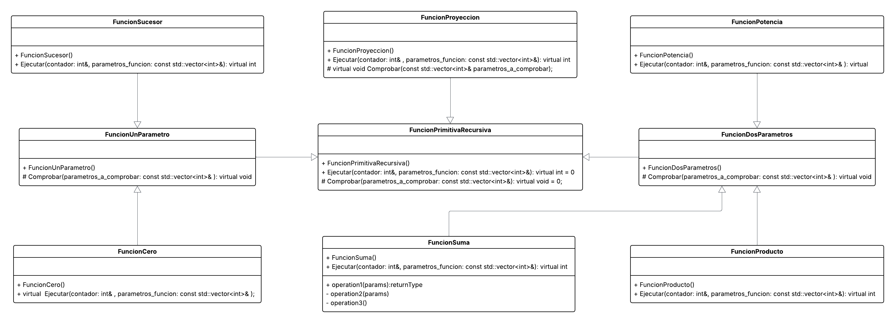

# Complejidad Computacional. Práctica 3. Implementación de Funciones Primitivas Recursivas.

En este repositorio se alojan los ficheros relacionados con la práctica 3 de Complejidad Computacional.

## Consideraciones a tener en cuenta.

### Acceso al repositorio en GitHub.
Para acceder al repositorio de GitHub de esta práctica, utilice [este enlace](https://github.com/DiegoHdezChico/CC-PR3-Implementacion_de_FPR.git).

### Compilar y ejecutar.
Para compilar el programa, utilizar el comando `make` desde el directorio principal. Del mismo modo, para eliminar el fichero fuente generado, puede utilizar el comando `make clean`. 

Para ejecutar el programa, escribir `./potencia_fpr`. Acto seguido el programa le pedirá que introduzca por entrada estándar tanto la ***base*** como el ***exponente*** de la potencia a calcular.

>[!WARNING]
> No intente pasar al programa una base o un exponente que no pertenezca a los [Numeros Naturales](https://es.wikipedia.org/wiki/N%C3%BAmero_natural) o el 0, ya que se producirá un error.

---

### Arquitectura del programa.
El programa en cuestión está compuesto por la siguiente arquitectura.

